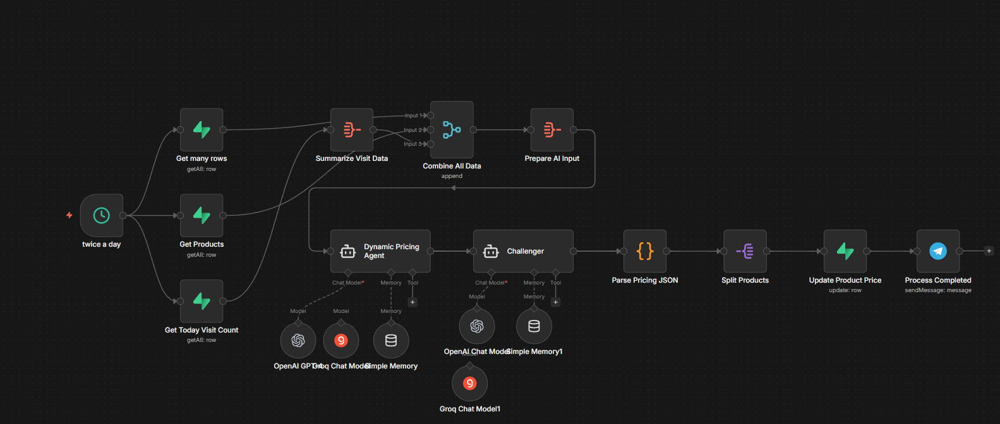
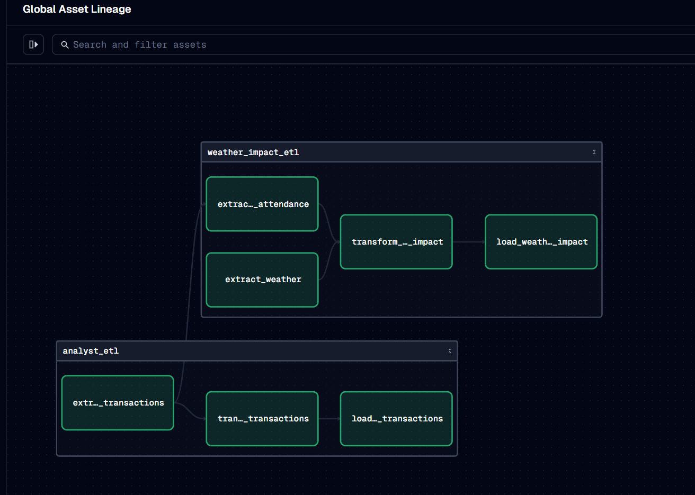
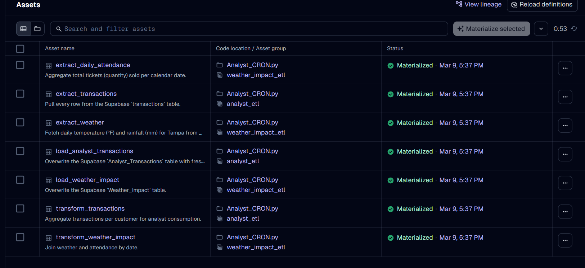
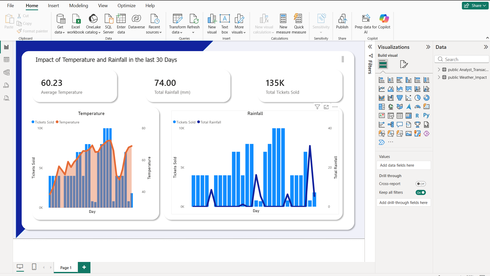

# loganmansfield.org — portfolio

Personal portfolio for **Logan Mansfield, Data Analyst** (Tampa, FL — open to
remote). Static HTML/CSS/JS, no build step, deployed on Vercel.

## Site structure

A deliberately lean two-page site, plus one archived project page:

- **Home** (`index.html`, `/`) — intro, availability, a featured project
  (Realtime Fraud Detection), a short about, and the fastest ways to connect.
- **Projects** (`projects.html`, `/projects`) — eFrog (live ML app), Realtime
  Fraud Detection, Owl Park (archived), and Lighthouse (coming soon), with a
  link out to GitHub for the rest.
- **Owl Park** (`owl-park-infographic.html`, `/owl-park`) — a standalone
  infographic of an archived end-to-end data pipeline.
- **404** (`404.html`) — branded not-found page.

Clean URLs (`/projects`, `/owl-park`) and legacy redirects are configured in
`vercel.json`.

## Assets

- `assets/tokens.css` — design tokens (dark canvas + electric-cyan accent;
  system font stack). Imported first on every page.
- `assets/shell.css` — top bar, nav, and page chrome.
- `assets/pages.css` — page/section components.
- `assets/transition.js` — SPA-style page transitions and the mobile nav.
- `assets/theme.js` — optional per-company accent theming via `?ink=<company>`
  (see [`docs/referrers.md`](docs/referrers.md)).
- `assets/profilepicture.webp` — circular hero avatar on the home page.
- `assets/favicon.svg`, `mini.jpg` — icons / share image.
- `assets/resume_current.pdf` — résumé served from the site.

The pages load the minified `.min` variants. After editing any source asset,
regenerate its minified file:

    npx esbuild <src> --minify --outfile=<min> --allow-overwrite

## Local development

No build step — serve the folder and open it:

    python3 -m http.server 8000

Note that `vercel.json` clean URLs/redirects aren't applied by a plain static
server; `vercel dev` reproduces production routing if needed.

## Validation gate

Portfolio changes are validated with the `no-mistakes` skill (`/no-mistakes`)
before opening a PR. See [`CLAUDE.md`](CLAUDE.md) for setup and environment
notes.

## Owl Park (archived project)

An earlier end-to-end pipeline built around a simulated ticket-sales
ecosystem: n8n agents generated demand and managed stock, data landed in
Supabase, Microsoft Fabric modeled it with a medallion architecture, and
Power BI turned it into decisions. A few visuals from that work:

