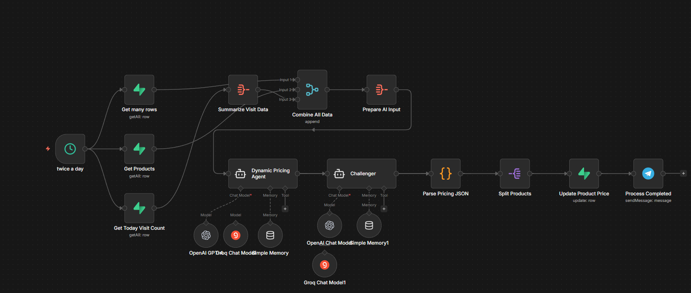
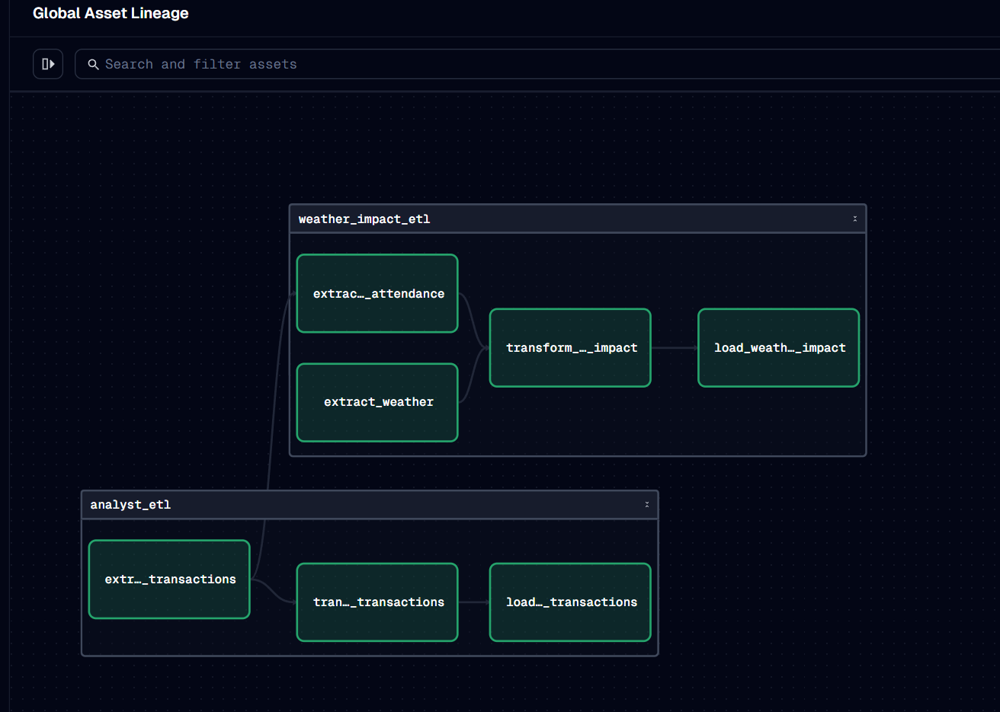
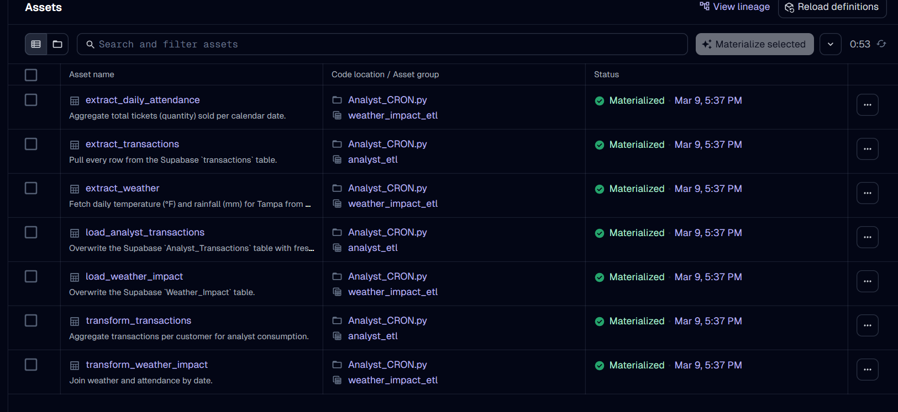
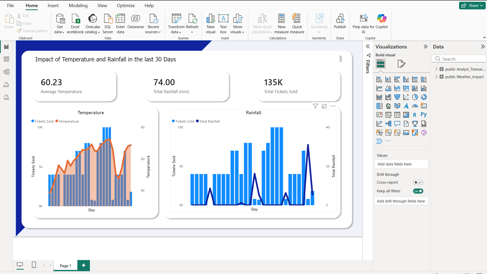

# loganmansfield.org — portfolio

Personal portfolio for **Logan Mansfield, Data Analyst** (Tampa, FL — open to
remote). Static HTML/CSS/JS, no build step, deployed on Vercel.

## Site structure

A deliberately lean site: Home, About, Projects, plus one archived project page:

- **Home** (`index.html`, `/`) — intro, availability, the canonical short bio
  ("In brief"), a featured project (Realtime Fraud Detection), a short about,
  and the fastest ways to connect.
- **About** (`about.html`, `/about`) — the canonical short bio, background,
  credentials, profile links, and the data-driven "Elsewhere / Mentions" list
  (`data/mentions.json`, hidden while empty — see
  [`docs/mentions.md`](docs/mentions.md)).
- **Projects** (`projects.html`, `/projects`) — eFrog (live ML app), Realtime
  Fraud Detection, Owl Park (archived), and Lighthouse (coming soon), with a
  link out to GitHub for the rest.
- **Owl Park** (`owl-park-infographic.html`, `/owl-park`) — a standalone
  infographic of an archived end-to-end data pipeline.
- **404** (`404.html`) — branded not-found page.

Clean URLs (`/about`, `/projects`, `/owl-park`) and legacy redirects are
configured in `vercel.json`, which also 308-redirects `www.` and the raw
`*.html` paths to the single canonical URL on `https://loganmansfield.org`.

## Assets

- `assets/tokens.css` — design tokens (dark canvas + electric-cyan accent;
  system font stack). Imported first on every page.
- `assets/shell.css` — top bar, nav, and page chrome.
- `assets/pages.css` — page/section components.
- `assets/transition.js` — SPA-style page transitions and the mobile nav; fires
  a `page:swap` event after each in-site transition.
- `assets/mentions.js` — renders `data/mentions.json` into the About page.
- `assets/theme.js` — optional per-company accent theming via `?ink=<company>`
  (see [`docs/referrers.md`](docs/referrers.md)).
- `assets/profilepicture.webp` (+ `profilepicture-256.webp` for the `srcset`)
  — circular hero avatar on Home and About.
- `assets/favicon-crow.png`, `mini.jpg` — icons.
- `assets/og-card.jpg` — 1200×630 Open Graph / Twitter card (source:
  `scripts/og-card/`, re-render with `scripts/og-card/render.mjs`).
- `assets/loganmansfield.pdf` — résumé served from the site.

The pages load the minified `.min` variants. After editing any source asset,
regenerate its minified file:

    npx esbuild <src> --minify --outfile=<min> --allow-overwrite

## Search & identity (SEO)

Every indexable page (all but the noindex 404) carries a canonical URL, a unique title (`<Page> | Logan Mansfield`;
the homepage is `Logan Mansfield — Data Analyst`) and description, Open Graph +
Twitter card tags, and JSON-LD. Home and About publish a `ProfilePage` whose
`mainEntity` is the one `Person` node (`https://loganmansfield.org/#person`);
other pages reference that `@id` as author. Profile links carry `rel="me"`.

- **Short bio**: the canonical paragraph appears word-for-word on Home
  ("In brief"), on About, and as the Person `description` in the JSON-LD of
  both pages. Change all four together.
- **Sitemap**: `sitemap.xml` is generated — after adding, removing or editing a
  page run `node scripts/build-sitemap.mjs` and commit the result.
- **Checks**: `python3 scripts/seo-check.py` and
  `node scripts/build-sitemap.mjs --check` run in CI (`.github/workflows/seo.yml`).

## Local development

No build step — serve the folder and open it:

    python3 -m http.server 8000

Note that `vercel.json` clean URLs/redirects aren't applied by a plain static
server; `vercel dev` reproduces production routing if needed.

## Validation gate

Portfolio changes are validated with the `no-mistakes` skill (`/no-mistakes`)
before opening a PR. See [`CLAUDE.md`](CLAUDE.md) for setup and environment
notes.

## Owl Park (archived project)

An earlier end-to-end pipeline built around a simulated ticket-sales
ecosystem: n8n agents generated demand and managed stock, data landed in
Supabase, Microsoft Fabric modeled it with a medallion architecture, and
Power BI turned it into decisions. A few visuals from that work:

